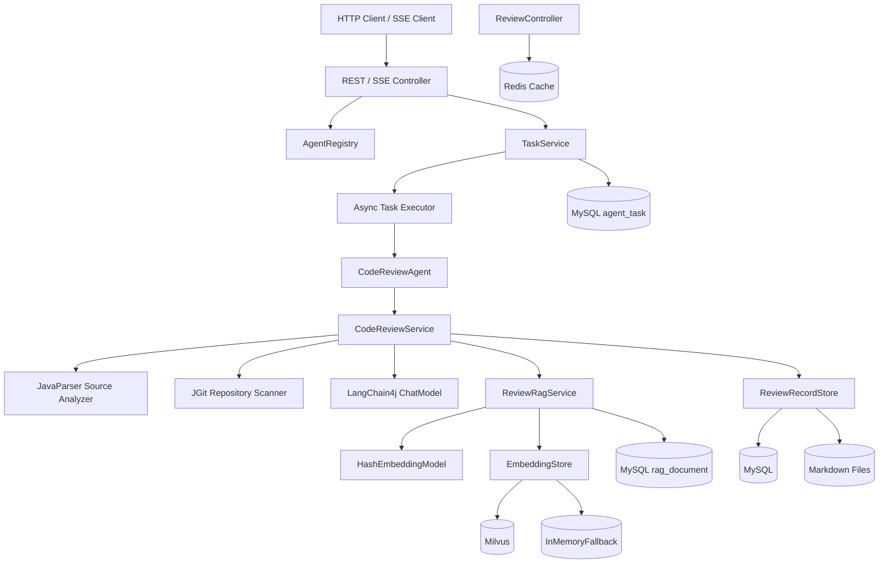

# 系统架构

## 分层设计

- **Controller 层**：`agent-server` 提供 REST 与 SSE 接口
- **Service 层**：任务编排、代码评审、报告生成、RAG 检索
- **Agent 层**：`DemoAgent`、`CodeReviewAgent`，通过注册中心统一管理
- **Core 层**：任务状态机、异步执行器、日志总线
- **Persistence 层**：Spring Data JPA 实体与 Repository
- **Cache 层**：Redis 缓存，本地/测试环境自动降级

## 关键流程

1. 用户调用 `POST /api/v1/reviews` 提交 Java 项目路径
2. 平台创建 `code_review_agent` 任务并异步执行
3. JGit 扫描仓库 Java 文件，JavaParser 静态分析并生成规则问题
4. 配置 `LLM_API_KEY` 时调用 LangChain4j 模型增强评审建议
5. 生成 Markdown 报告并保存到 MySQL + 文件
6. 报告写入 RAG 向量库（默认内存库，配置后切换 Milvus），后续评审可检索历史知识
7. 客户端通过 SSE 实时查看任务日志与状态
